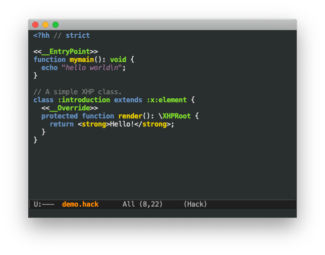

# hack-mode [](http://melpa.org/#/hack-mode)

`hack-mode` is an Emacs major mode for editing [Hack](https://hacklang.org/) code.



`hack-mode` includes extensive, precise syntax highlighting:

* Comment highlighting (additionally highlighting special comments
  like `strict`, `HH_FIXME`)
* Keyword highlighting (case insensitive where appropriate)
* String (`'foo', `"foo"`, `<<<FOO` and `<<<'FOO'`) highlighting,
  including interpolation
* XHP support

It also provides indentation, integration with `hackfmt` and
parenthesis match highlighting.

## Installation

Install from MELPA, or load this package into your elisp load-path.

## Configuration

After installation, `hack-mode` will automatically run on `.hack`,
`.hck` and `.hhi` files.

It will also run on `.php` files, but `php-mode` will take precedence
if installed. If you want `hack-mode` to take precedence, use the
following:

```emacs-lisp
(add-to-list 'auto-mode-alist '("\\.php\\'" . hack-mode))
```

### Formatting

`hack-mode` provides `hack-format-buffer` to run `hackfmt` on the
whole file. If you'd like this automatically run on save, add it to
your hooks:

```emacs-lisp
(add-hook 'hack-mode-hook #'hack-enable-format-on-save)
```

### Other Packages

We recommend using hack-mode with the following minor-modes:

```emacs-lisp
(add-hook 'hack-mode-hook #'lsp)
(add-hook 'hack-mode-hook #'flycheck-mode)
(add-hook 'hack-mode-hook #'company-mode)
```


## License

hack-mode is licensed under the GNU General Public License v3.0.
